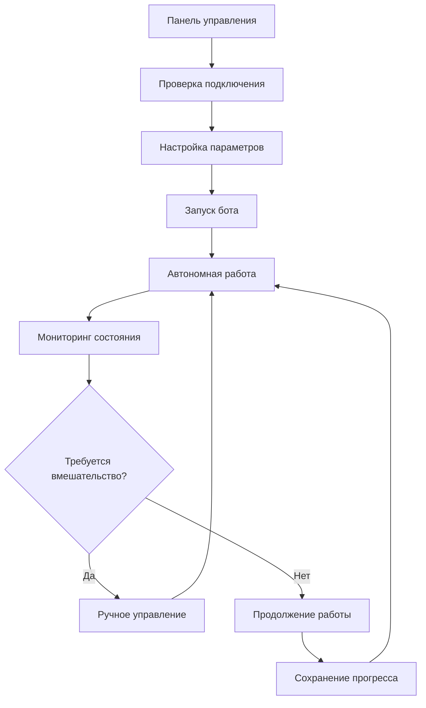

## 1. Обзор продукта
Автономный Minecraft бот версии 1.19.4, построенный на Node.js и Mineflayer, который способен к самостоятельному выживанию, исследованию и развитию в игровом мире без участия игрока.

Бот решает проблему пассивного игрового опыта, предоставляя полностью автономного агента, который может строить базы, добывать ресурсы, крафтить предметы и учиться на основе предыдущего опыта. Цель - создать интеллектуального игрового компаньона или противника, способного к долгосрочному развитию.

## 2. Основные функции

### 2.1 Роли пользователей
| Роль | Метод регистрации | Основные разрешения |
|------|-------------------|---------------------|
| Администратор бота | Локальная конфигурация | Полный доступ к настройкам, мониторинг состояния, перезапуск |
| Наблюдатель | Подключение к web-интерфейсу | Просмотр статистики, состояния бота, журналов действий |

### 2.2 Модуль функций
Основные компоненты системы:
1. **Панель управления**: запуск/остановка бота, базовые настройки, статус подключения
2. **Мониторинг состояния**: отображение текущих задач, инвентаря, здоровья, координат
3. **Журнал действий**: история принятых решений, выполненных задач, обнаруженных ошибок
4. **Настройки поведения**: конфигурация приоритетов задач, параметров исследования, правил безопасности

### 2.3 Детали страниц
| Название страницы | Название модуля | Описание функции |
|-------------------|-----------------|------------------|
| Панель управления | Статус подключения | Отображает состояние подключения к серверу Minecraft, версию игры, ping |
| Панель управления | Управление ботом | Запускает, останавливает и перезапускает бота с сохранением текущего прогресса |
| Панель управления | Быстрые действия | Принудительное выполнение экстренных действий: возврат домой, укрытие, эвакуация |
| Мониторинг состояния | Игровые параметры | Отображает здоровье, голод, уровень опыта, текущие координаты, время суток |
| Мониторинг состояния | Текущая задача | Показывает активную цель, прогресс выполнения, оставшееся время |
| Мониторинг состояния | Инвентарь | Визуализация содержимого инвентаря с фильтрацией по типам предметов |
| Журнал действий | Хронология событий | Лента временных отметок с описанием действий бота и их результатов |
| Журнал действий | Аналитика | Статистика по типам действий, успешности выполнения задач, ошибкам |
| Настройки поведения | Приоритеты задач | Настройка важности различных активностей: добыча, строительство, исследование |
| Настройки поведения | Параметры безопасности | Настройка уровня риска, дистанции обнаружения врагов, правил укрытия |
| Настройки поведения | Параметры обучения | Настройка скорости обучения, размера памяти, приоритетов запоминания |

## 3. Основные процессы

### Процесс запуска бота:
1. Пользователь открывает панель управления и проверяет статус подключения к Minecraft серверу
2. Настраивает базовые параметры: имя бота, координаты дома, приоритеты задач
3. Запускает бота, система начинает автономную работу
4. Бот последовательно выполняет задачи: исследование местности, добыча ресурсов, строительство укрытия
5. Система сохраняет прогресс и обучается на основе успешности действий

### Процесс обучения и адаптации:
1. Бот запоминает успешные маршруты и опасные зоны
2. Анализирует эффективность различных стратегий крафта и строительства
3. Адаптирует приоритеты задач на основе игровой ситуации (погода, время суток, угрозы)
4. Сохраняет лучшие практики в долгосрочную память для использования в будущем

## 4. Дизайн пользовательского интерфейса

### 4.1 Стиль дизайна
- **Цветовая палитра**: Темно-серый фон (#1a1a1a), зеленый для успешных статусов (#4ade80), красный для ошибок (#ef4444), синий для информации (#3b82f6)
- **Стиль кнопок**: Плоские с закругленными углами (border-radius: 8px), эффект подсветки при наведении
- **Типографика**: Моноширинный шрифт JetBrains Mono для логов и кода, системный шрифт для интерфейса
- **Макет**: Карточная структура с четким разделением функциональных блоков, фиксированная боковая навигация
- **Иконки**: Минималистичные линейные иконки из набора Lucide React

### 4.2 Обзор дизайна страниц
| Название страницы | Название модуля | UI элементы |
|-------------------|-----------------|-------------|
| Панель управления | Статус подключения | Круговой индикатор состояния, текстовое описание, кнопка переподключения |
| Панель управления | Управление ботом | Крупные кнопки с иконками, цветовая индикация состояния, таймер работы |
| Мониторинг состояния | Игровые параметры | Горизонтальные прогресс-бары для здоровья и голода, цифровые координаты |
| Мониторинг состояния | Инвентарь | Сетка из 9x3 ячеек с иконками предметов, всплывающие подсказки с названиями |
| Журнал действий | Хронология событий | Обратный хронологический порядок, цветовая маркировка типов событий, фильтры |
| Настройки поведения | Приоритеты задач | Drag-and-drop список для упорядочивания, ползунки для весовых коэффициентов |

### 4.3 Адаптивность
Продукт ориентирован на desktop-first использование с адаптацией для планшетов. Основная аудитория - администраторы серверов и разработчики, которые будут использовать полноразмерные экраны для мониторинга. Мобильная версия предоставляет базовый доступ к статусу и возможность экстренного управления.

### 4.4 Руководство по 3D сцене
Не применимо для данного проекта.