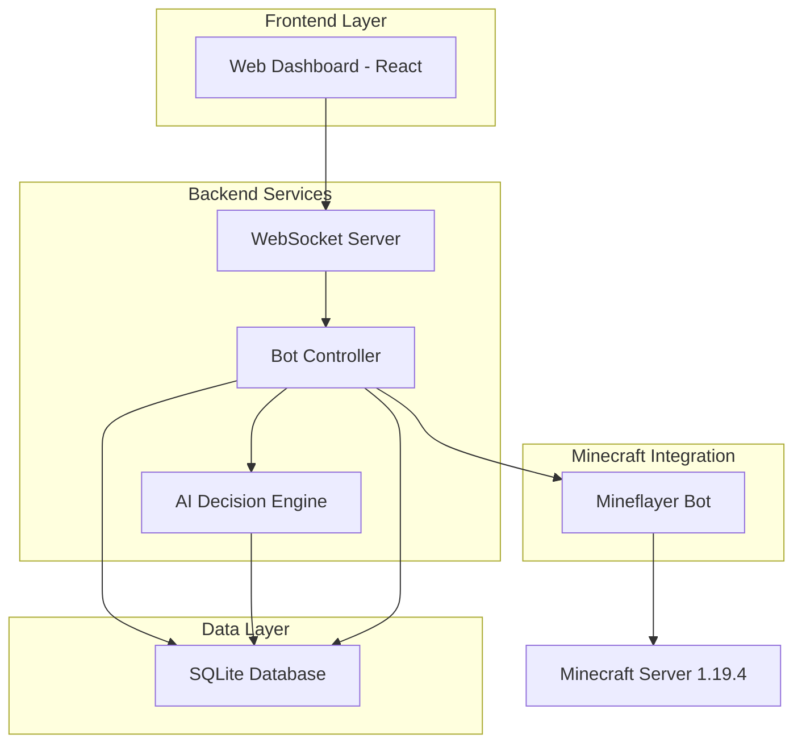
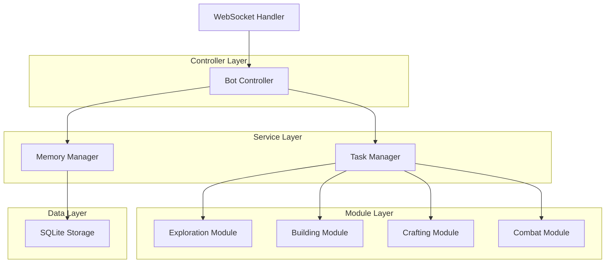
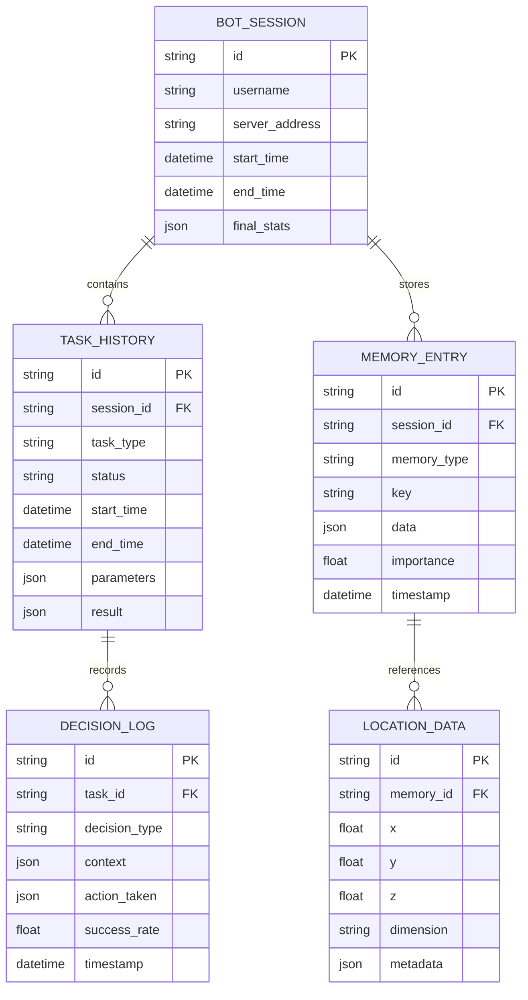

## 1. Архитектура системы



## 2. Описание технологий

* **Frontend**: React\@18 + TypeScript + TailwindCSS + Vite

* **Backend**: Node.js\@18 + Express\@4 + WebSocket

* **Database**: SQLite3 для локального хранения памяти и статистики

* **Minecraft Integration**: Mineflayer\@4 для управления ботом

* **AI/ML**: TensorFlow\.js для обучения на основе опыта

* **Инициализация**: npm init + vite для frontend части

## 3. Определение маршрутов

| Маршрут         | Назначение                                             |
| --------------- | ------------------------------------------------------ |
| /               | Главная панель управления с кнопками запуска/остановки |
| /status         | Страница мониторинга текущего состояния бота           |
| /logs           | Журнал действий с фильтрацией и поиском                |
| /settings       | Настройки поведения и приоритетов задач                |
| /api/bot/start  | API endpoint для запуска бота                          |
| /api/bot/stop   | API endpoint для остановки бота                        |
| /api/bot/status | Получение текущего статуса бота                        |
| /api/bot/logs   | Получение журнала действий                             |
| /ws             | WebSocket соединение для realtime обновлений           |

## 4. Определения API

### 4.1 Управление ботом

**Запуск бота**

```
POST /api/bot/start
```

Request:

| Параметр | Тип    | Обязательный | Описание                          |
| -------- | ------ | ------------ | --------------------------------- |
| username | string | да           | Имя бота в Minecraft              |
| server   | string | да           | Адрес сервера                     |
| port     | number | нет          | Порт сервера (по умолчанию 25565) |

Response:

```json
{
  "success": true,
  "botId": "uuid-string",
  "status": "connecting"
}
```

**Получение статуса**

```
GET /api/bot/status
```

Response:

```json
{
  "connected": true,
  "health": 20,
  "hunger": 18,
  "position": {
    "x": 100.5,
    "y": 64.0,
    "z": -200.3
  },
  "currentTask": "exploring",
  "inventory": [
    {"type": "diamond", "count": 5},
    {"type": "wood", "count": 64}
  ]
}
```

### 4.2 Управление настройками

**Обновление приоритетов**

```
PUT /api/settings/priorities
```

Request:

```json
{
  "exploration": 0.7,
  "mining": 0.8,
  "building": 0.6,
  "combat": 0.3,
  "crafting": 0.5
}
```

## 5. Архитектура сервера



## 6. Модель данных

### 6.1 Определение модели данных



### 6.2 Определение языка данных (DDL)

**Таблица сессий бота**

```sql
-- Таблица сессий
CREATE TABLE bot_sessions (
    id TEXT PRIMARY KEY,
    username TEXT NOT NULL,
    server_address TEXT NOT NULL,
    start_time DATETIME DEFAULT CURRENT_TIMESTAMP,
    end_time DATETIME,
    final_stats TEXT -- JSON string
);

-- Таблица истории задач
CREATE TABLE task_history (
    id TEXT PRIMARY KEY,
    session_id TEXT NOT NULL,
    task_type TEXT NOT NULL,
    status TEXT NOT NULL,
    start_time DATETIME DEFAULT CURRENT_TIMESTAMP,
    end_time DATETIME,
    parameters TEXT, -- JSON string
    result TEXT, -- JSON string
    FOREIGN KEY (session_id) REFERENCES bot_sessions(id)
);

-- Таблица памяти бота
CREATE TABLE memory_entries (
    id TEXT PRIMARY KEY,
    session_id TEXT NOT NULL,
    memory_type TEXT NOT NULL,
    key TEXT NOT NULL,
    data TEXT NOT NULL, -- JSON string
    importance REAL DEFAULT 0.5,
    timestamp DATETIME DEFAULT CURRENT_TIMESTAMP,
    FOREIGN KEY (session_id) REFERENCES bot_sessions(id)
);

-- Таблица логов решений
CREATE TABLE decision_logs (
    id TEXT PRIMARY KEY,
    task_id TEXT NOT NULL,
    decision_type TEXT NOT NULL,
    context TEXT NOT NULL, -- JSON string
    action_taken TEXT NOT NULL, -- JSON string
    success_rate REAL,
    timestamp DATETIME DEFAULT CURRENT_TIMESTAMP,
    FOREIGN KEY (task_id) REFERENCES task_history(id)
);

-- Таблица локаций
CREATE TABLE location_data (
    id TEXT PRIMARY KEY,
    memory_id TEXT NOT NULL,
    x REAL NOT NULL,
    y REAL NOT NULL,
    z REAL NOT NULL,
    dimension TEXT DEFAULT 'overworld',
    metadata TEXT, -- JSON string
    FOREIGN KEY (memory_id) REFERENCES memory_entries(id)
);

-- Индексы для производительности
CREATE INDEX idx_sessions_username ON bot_sessions(username);
CREATE INDEX idx_sessions_start_time ON bot_sessions(start_time);
CREATE INDEX idx_tasks_session ON task_history(session_id);
CREATE INDEX idx_tasks_type ON task_history(task_type);
CREATE INDEX idx_memory_session ON memory_entries(session_id);
CREATE INDEX idx_memory_type ON memory_entries(memory_type);
CREATE INDEX idx_memory_importance ON memory_entries(importance);
CREATE INDEX idx_decisions_task ON decision_logs(task_id);
CREATE INDEX idx_locations_coords ON location_data(x, z);
```

### 6.3 Инициализация данных

```sql
-- Начальные настройки приоритетов
INSERT INTO memory_entries (id, session_id, memory_type, key, data, importance) VALUES
('default_priorities', 'system', 'configuration', 'task_priorities', 
'{"exploration": 0.7, "mining": 0.8, "building": 0.6, "combat": 0.3, "crafting": 0.5}', 1.0);

-- Базовые правила безопасности
INSERT INTO memory_entries (id, session_id, memory_type, key, data, importance) VALUES
('safety_rules', 'system', 'configuration', 'safety_config',
'{"hostile_detection_range": 20, "shelter_search_range": 50, "emergency_health_threshold": 6}', 1.0);
```

